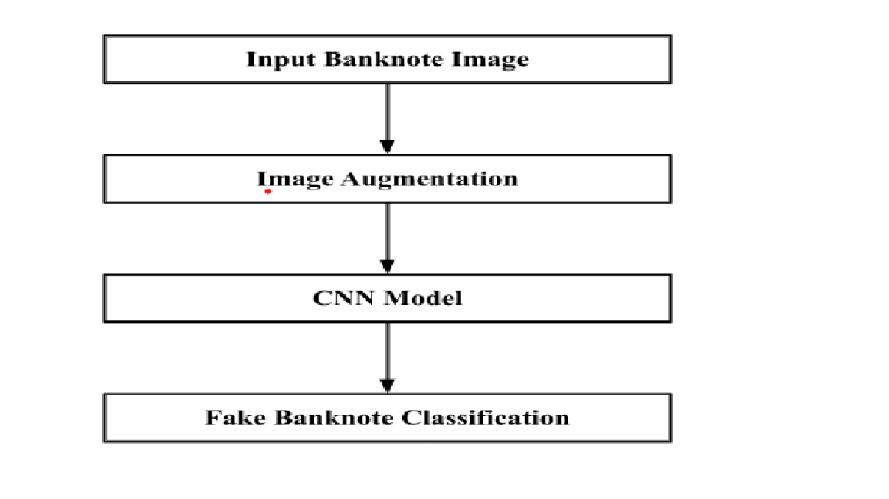
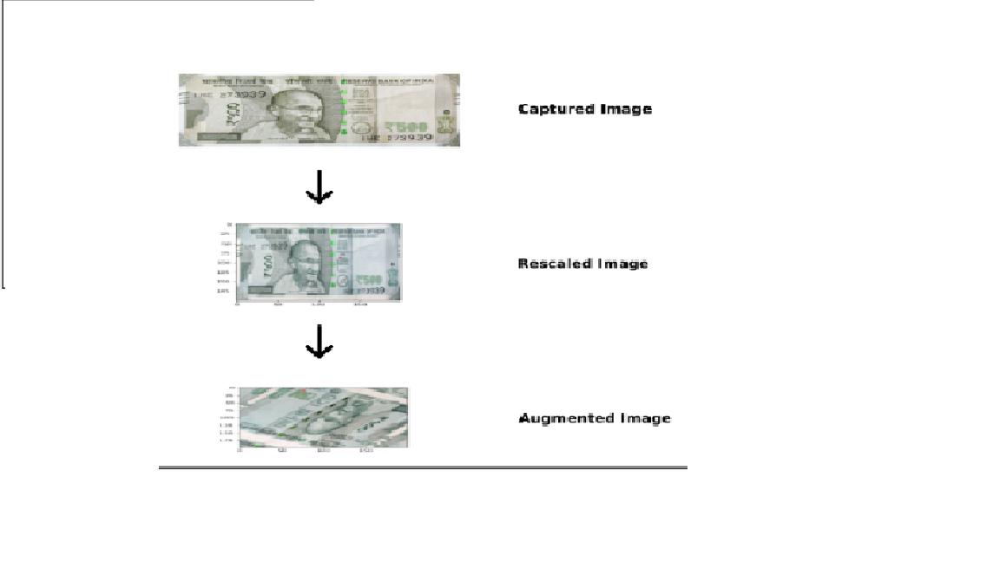
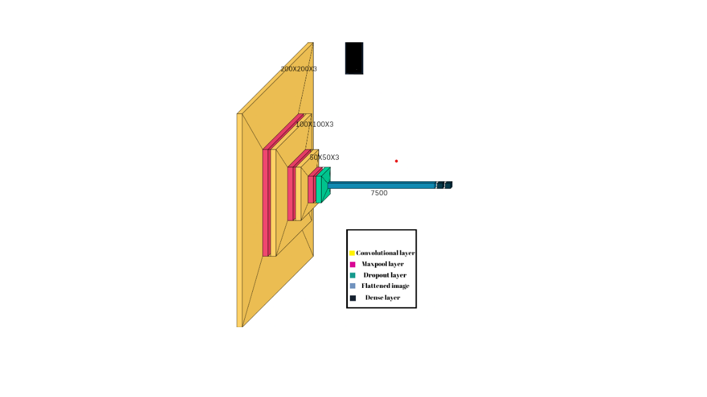

]# Fake Currency Classifier

The advancement of digital editing and printing technology in recent years has led to several unintended consequences, such as falsification of reports and counterfeiting currencies.
India is also grappling with this problem and the ₹500 is the worst hit.A recent RBI finding stated that their has been a 101% increase year on year in the number of counterfeit ₹500 notes in circulation.

By this project we are trying to employ image processing and CNN to propose a solution to the epidemic of cheap imitations of our currency(viz. ₹500 notes).

## Dataset used
We created our own dataset for the purpose of this project
### Idea behind the dataset
Some most easily recognizable features of an authentic note are:
Gandhi ji's image at the front, the signature of the governor of india, the number of languages at the back and the security thread and the raised printing.
So we took authentic bank notes and tampered with them and other security features .
Original notes: 

 back view:https://drive.google.com/drive/folders/1ruTyueTpSt_Ju-hjvTr53XEWi2LXzZi4?usp=sharing

front view :https://drive.google.com/drive/folders/1B0Ac6u4_ZpWakJZp-7_qM48seUhpBiIq?usp=sharing

Counterfeit notes:https://drive.google.com/drive/folders/1IsHn-kkHvG3KsgZgHmqZ874_u0hLP21s?usp=sharing
## Architecture
The overall methodology of the model is as follows

The scaling and image augmentation is done in the following way

The architecture of the CNN model 

